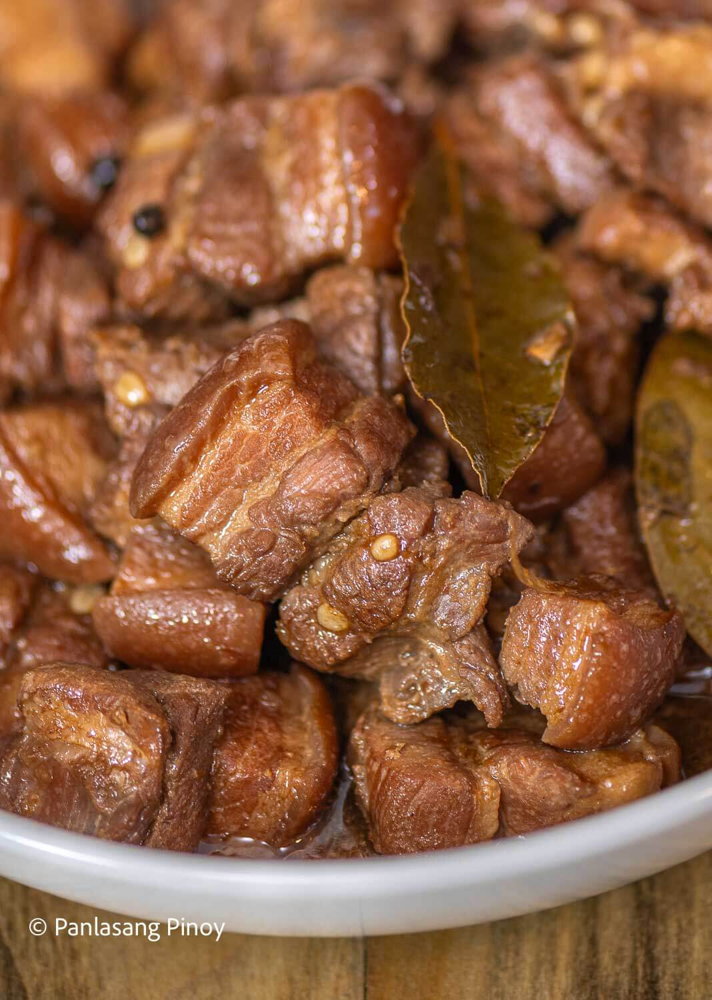

# Adobo Pork Belly

Makes **four portions**.

## Ingredients

* **2 Lbs. (900g)** Pork Belly.
* **2 Tablespoons** of Minced Garlic.
* **5 Dried** Bay Leaves.
* **4 Tablespoons** White Vinegar.
* **1/2 Cup (116g)** Soy Sauce.
* **1 Tablespoon** Ground Pepper.
* **2 Cups (500g)** Water.
* Salt to taste.

## Recipe

1. Combine the pork belly, soy sauce, and garlic then marinade for at least **1 hour**.
1. Heat the pot and put-in the marinated pork belly then cook for **5 minutes**.
1. Pour remaining marinade including garlic into pot.
1. Add water, whole pepper corn, and dried bay leaves then **bring to a boil**, then **Simmer for 40 minutes to 1 hour**.
1. Put-in the **vinegar** and **simmer for 12 to 15 minutes**.
1. Add salt to taste.
1. **Serve hot**. Share and enjoy!