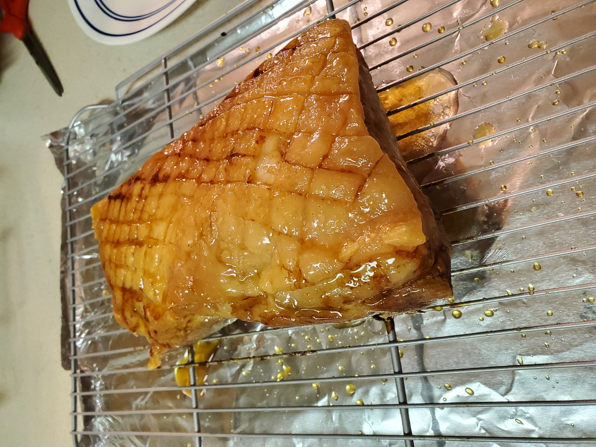

# Pork Belly Crackling

## Ingredients

(serves about 4)

* **1kg slab** of pork belly.
* **Sunflower oil**.
* **Salt**.
* **Water**.
* **600g honey**.
* **6 star anise**.
* **1 Tbsp.** cracked / ground coriander seeds.

### Optional Ingredients; See Step 4

* 4 brown onions (?)
* 1 bunch of sage (?)
* 4 bay leaves (?)

## Directions

1. **Make sure the pork belly is dry to begin with**. Rub some sunflower oil all over the pork belly. Season with a little salt.

1. Place the pork belly onto an oven proof rack. Place the rack over a roasting tray containing ~1.5cm of water (the pork should be hovering above the water on the rack). Place into the oven, bottom shelf, 320°F for 1.5-2 hours until cooked, crispy and golden brown. (I had to roast for 2.5 - 3 hours on my initial try. Probably becauase I kept opening the oven door every half hour to check on the pork.)

1. Meanwhile, add honey, 200ml water, coriander and star anise to a saucepan. Simmer to reduce volume by half, until it resembles a syrup.

1. Place a little sunflower oil into a pan. Peel and halve the onions, then gently fry in the pan with the bay leaves and sage on top for a few minutes. Transfer to the oven for 20-25 minutes until onions are cooked and golden brown.
   * **Note**: I will admit that the onions and sage were more of a garnish than necessary. Though the smells of roasting sage will make your home smell incredible, the onions I felt didn't realy absorb the flavors and didn't roast very well. **I would say that this is an optional step**.

1. When pork belly is cooked, remove from oven and allow to rest. Take the tray of water underneath (which by now will contain pork juices) and pour into a new saucepan. Reduce by a third to make gravy. If you want thicker gravy, add a Tbsp. of flour to the gravy while it is reducing. **Add a tablespoon of the honey reduction** to the gravy when the gravy has finished reducing.

1. Glaze the pork belly **generously** with the honey reduction then cut into 1 inch strips. Arrange on a serving plate, and cover with the roast onions and leaves. Pour the meat-juice gravy over everything and serve.

## Credits

https://www.youtube.com/watch?v=psNGoGb8ykw
https://nocturneinblue.livejournal.com/3133.html