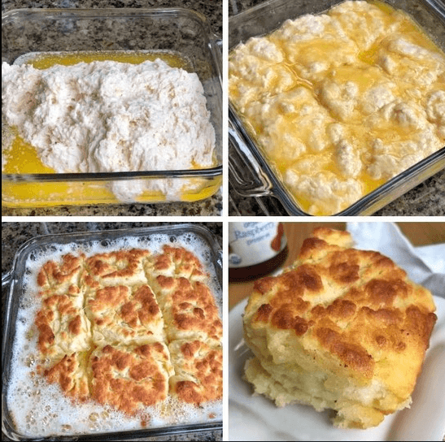

# Butter Swim Biscuits

# Ingredients

* **2 1/2 Cups** of All-Purpose Flour.
* **2 Cups** of Buttermilk
* **1 Stick** of Butter
* **4 Tsp.** of Baking Powder
* **4 Tsp.** of Sugar
* **2 Tsp.** of Salt

# Recipe

1. Preheat the oven to **450 degrees Fahrenheit**.

1. Combine all of the **dry ingredients** in a medium sized bowl.

1. Next, add the **buttermilk** and mix all of the ingredients together until a moist dough is formed.

1. **Melt the butter in a microwave** safe bowl, and then *pour it into an 8×8 or 9×9 baking dish* (make sure that your pan is not too small or shallow so that the butter doesn’t drip out of the pan while it’s baking).

1. Place the dough right on top of the melted butter and use a spatula to spread it evenly across the pan until it touches the sides.

1. Cut the unbaked dough (it should be swimming in butter at this point) into 9 even squares.

1. Bake for **20-25 minutes** or until golden brown on top.

Enjoy for breakfast, lunch or dinner! These biscuits are the perfect companion to any meal. I prefer to eat them with raspberry jam.

# Credits

https://imgur.com/gallery/TXKHiDS
