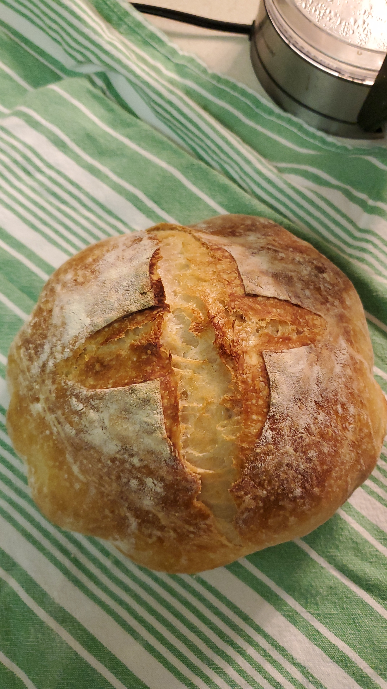

# No-Knead Dough

# Ingredients

* **3 1/2 Cups** of All-Purpose or Bread flour, plus more for dusting.
* **Generous 1/4 Teaspoon** of instant yeast.
* **2 Teaspoons** kosher salt
* **1 1/2 Cups** water
* Cornmeal, wheat bran, of flour to prevent sticking to surfaces.
* Time
   * 12 - 18 hours for dough to rise
   * 2 hours, 15 minutes for dough to rest on counter
   * About 35 minutes of baking

# Instructions

1. In a large bowl combine flour, yeast and salt. Add **1½ cups/345 grams** water and stir until blended; dough should come together and be sticky. Cover bowl with plastic wrap. Let dough rest at least 12 hours, preferably about 18, at warm room temperature, about 70 degrees.
   * If the dough didn't come together into a solid mass and isn't sticky, try adding **1 Teaspoon** of water to the dough and try mixing. Continue adding **1 Teaspoon** of water until all of the dough comes together and is sticky.

1. Dough is ready when its surface is dotted with bubbles (see example below). Place some parchment paper (makes cleanup easier) and lightly flour the surface and place dough on it; sprinkle it with a little more flour. Looking at the dough, take the left and right sides and fold them towards the middle. Repeat once more, but with the top and bottom sides. Cover loosely with parchment paper or a tea towel and let **rest about 15 minutes**.
   1. 

1. Generously coat some parchment paper with **flour, wheat bran or cornmeal**; round the dough into a ball and put dough seam side down on parchment paper and dust with more flour, bran or cornmeal. Cover with another piece of parchment paper or a tea towel and **let rise for about 90 minutes**. When it is ready, dough will be more than double in size and will not readily spring back when poked with a finger.

1. You thought that you were done waiting, but you would be wrong: **you have to wait an additional 30 minutes!** _While you're waiting_, place a dutch oven (cast iron, enamel, pyrex, or ceramic) into a **COLD** oven with its lid on top and close the door. Begin heating the oven to **450 degrees Fahrenheit** **WITH THE DUTCH OVEN INSIDE OF THE OVEN!**
   1. The dutch oven and your stove need to increase in temperature together. If you place a cold dutch oven into a hot oven, the temperature differential could cause your dutch oven to crack! And if the enamel cracks, you're screwed!
   1. Now is also the time to put cuts into the dough to make a nice design. Start with a simple cross-cut (see below for an example).

1. When dough is ready, carefully remove dutch oven from oven. Remove the top piece of parchment paper or tea towel, and pick up the bread dough by the parchment paper and place directly into the dutch oven. It may look like a mess, but that is OK since the dough straightens out as it bakes. 

1. **Cover with lid, place dutch oven into oven, and bake 30 minutes**.

1. After **30 minutes**, **remove lid and bake another 5 minutes uncovered**, or until loaf is beautifully browned. 
   1. The image below is what it looked like with only 5 minutes uncovered. Keep the bread in the oven longer for a darker crust, if desired.

1. Cool on a rack.

# Credits

https://cooking.nytimes.com/recipes/11376-no-knead-bread