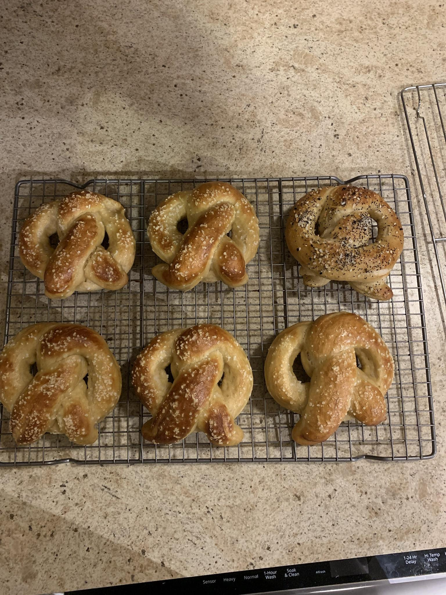

# Pretzels

# Ingredients

## Dough

* **354g** of Water at **(110 to 115 degrees F)** (43-46C)
* **12g** Sugar 
* **8g** Kosher Salt
* **10g** Active Dry Yeast
* **623g** All-Purpose Flour or Bread Flour 
* **56g** Unsalted Butter, melted
* **Optional** some sort of seasoning, such as "everything bagel", onion, garlic, etc.
* **1 Large** Egg **(for egg wash -- do not put in dough!)**

## Watch for Boiling

* **2250g** Water
* **176g** Baking Soda

# Recipe

1. Mix dough; Weigh out **4oz (113g)** dough balls and roll to **24 in.** **(60centimeter)** and make pretzel shape; Let it sit and rise for **another 30mins**. See [this video on how to shape a pretzel](https://www.youtube.com/watch?v=uwy9c0foFTc)

1. Boil pretzels in water with baking soda for **30secs-2mins**; Let them rest for **5mins** on a wire rack once done boiling.
 
1. Brush egg yolk beaten with **1 tablespoon of water**
Sprinkle pretzel salt.

1. Bake for **450F** (232C) **12-15mins**.

# Credits

https://imgur.com/gallery/RPRMWGM
