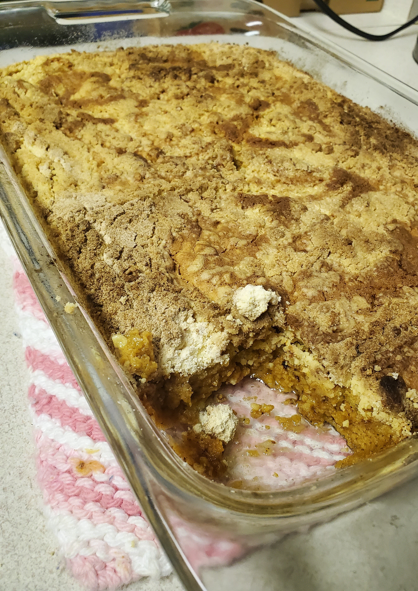

# Pumpkin (Cake) Dessert

## Ingredients

1. 1 - 15oz can of pumpkin
1. 1 - 12oz can of evaporated milk (Nestle Carnation)
1. 3 large eggs
1. 1 Cup of sugar
1. 4 Tsp. of pumpkin spice mix
1. 1 Pkg. of yellow cake mix (Duncan Heinz)
1. 3/4 Cup of melted butter

1 9 X 13 baking pan

## Recipe

1. Mix pumpkin, evaporated milk, eggs, sugar, & pumpkin pie spice in a bowl.
1. Pour in **greased** 9 X 13 baking pan.
1. Sprinkle **dry cake mix** over top of batter.
1. Drizzle melted butter over cake mix.

1. Bake at 350 degrees Fahrenheit for 1 hour or until a knife comes out clean.

